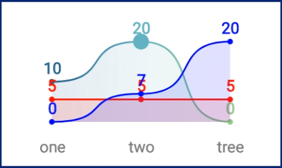

# Extended Microcharts

This work is based on [Microcharts](https://github.com/aloisdeniel/Microcharts) by [Aloïs Deniel](http://aloisdeniel.github.io)

## Compatibility

This work is a charting library targeting **Xamarin.Forms**, **Xamarin.iOS** and **Xamarin.Android** platforms and extending capabilities of its predecessor. 
New features include:
* support for multiple series on one graph for `PointChart` and `LineChart`
* displaying value labels (horizontally instead of vertically) just above data points
* selecting (by changing its size) the nearest data point from location of user's tapping

## Gallery
 



## Limitations
* all series have to have the same labels (for x-axis) 
* number of entries (points) in each series must be equal

## Quickstart

### 1°) Your chart will need a set of data entries.

```csharp
var testData1 = new[]
{
	new Entry(10)
	{
		Label = "one",
		ValueLabel = "10",
		Color = SKColor.Parse("#266489")
	},
	new Entry(20)
	{
		Label = "two",
		ValueLabel = "20",
		Color = SKColor.Parse("#68B9C0")
	},
	new Entry(0)
	{
		Label = "tree",
		ValueLabel = "0",
		Color = SKColor.Parse("#90D585")
	}
};

var testData2 = new[]
{
	new Entry(5)
	{
		Label = "one",
		ValueLabel = "5",
		Color = new SKColor(255, 0, 0)
	},
	new Entry(5)
	{
		Label = "two",
		ValueLabel = "5",
		Color = new SKColor(255, 0, 0)
	},
	new Entry(5)
	{
		Label = "tree",
		ValueLabel = "5",
		Color = new SKColor(255, 0, 0)
	}
};

var testData3 = new[]
{
	new Entry(0)
	{
		Label = "one",
		ValueLabel = "0",
		Color = new SKColor(0, 0, 255)
	},
	new Entry(7)
	{
		Label = "two",
		ValueLabel = "7",
		Color = new SKColor(0, 0, 255)
	},
	new Entry(20)
	{
		Label = "tree",
		ValueLabel = "20",
		Color = new SKColor(0, 0, 255)
	}
};

```

### 2°) Instanciate a chart from those entries

```csharp
Chart = new LineChart()
{
	PointMode = PointMode.Circle,
	Series = new List<List<Entry>>() {testData1.ToList(), testData2.ToList(), testData3.ToList()},
	PointAreaAlpha = 128,
	ValueLabelRotation = false,
	LabelTextSize = 28
};
```

### 3°) Add it to your UI!

**Xamarin.iOS**

```csharp
public override void ViewDidLoad()
{
    base.ViewDidLoad();

    var entries = // ... see 1°) above
    var chart = // ... see 2°) above

    var chartView = new ChartView
    {
        Frame = new CGRect(0, 32, this.View.Bounds.Width, 140),
        AutoresizingMask = UIViewAutoresizing.FlexibleWidth,
        Chart = chart
    };

	this.View.AddSubview(chartView);
}
```

**Xamarin.Android**

```xml
<?xml version="1.0" encoding="utf-8"?>
<ScrollView xmlns:android="http://schemas.android.com/apk/res/android"
    android:layout_width="match_parent"
    android:layout_height="match_parent">
    <LinearLayout 
        android:orientation="vertical"
        android:layout_width="match_parent"
        android:layout_height="wrap_content">
        <microcharts.droid.ChartView
            android:id="@+id/chartView"
            android:layout_width="match_parent"
            android:layout_height="160dp" />
    </LinearLayout>
</ScrollView>
```

```csharp
protected override void OnCreate(Bundle savedInstanceState)
{
    base.OnCreate(savedInstanceState);

    SetContentView(Resource.Layout.Main);

    var entries = // ... see 1°) above
    var chart = // ... see 2°) above

    var chartView = FindViewById<ChartView>(Resource.Id.chartView);
    chartView.Chart = chart;
}
```

**Xamarin.Forms**

```xml
<ContentPage 
    xmlns="http://xamarin.com/schemas/2014/forms" 
    xmlns:x="http://schemas.microsoft.com/winfx/2009/xaml" 
    xmlns:microcharts="clr-namespace:Microcharts.Forms;assembly=Microcharts.Forms" 
    xmlns:local="clr-namespace:Microcharts.Samples.Forms" 
    x:Class="Microcharts.Samples.Forms.MainPage">

    <microcharts:ChartView x:Name="chartView" />

</ContentPage>
```

```csharp
protected override void OnAppearing()
{
    base.OnAppearing();

    var entries = // ... see 1°) above
    var chart = // ... see 2°) above

    this.chartView.Chart = chart;
}
```

## Usage

Available charts are `BarChart`, `PointChart`, `LineChart`, `DonutChart`, `RadialGaugeChart`, `RadarChart`. They all have several properties to tweak their rendering.

Those charts have a `Draw` method for platforms that haven't built in views.

## Contributions

Contributions are welcome! If you find a bug please report it and if you want a feature please report it.

If you want to contribute code please file an issue and create a branch off of the current dev branch and file a pull request.

## License

MIT

If you like my content, please consider buying me a coffee. Thank you for your support!
[](https://www.buymeacoffee.com/JALQwKaqH)
